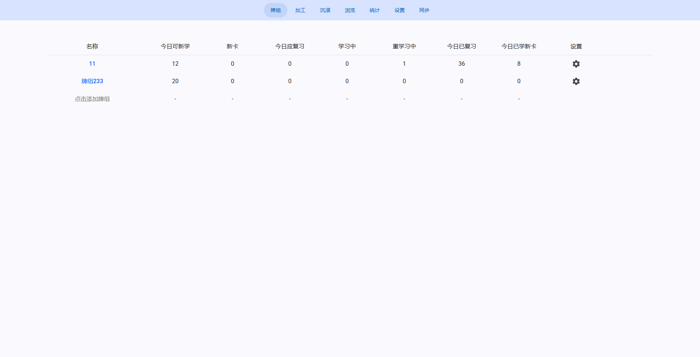
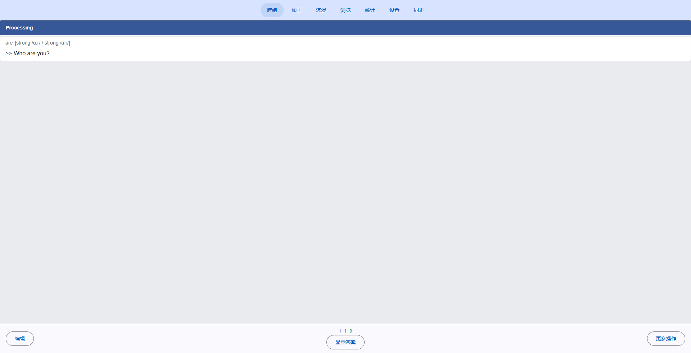
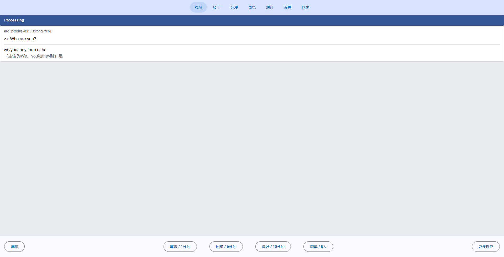
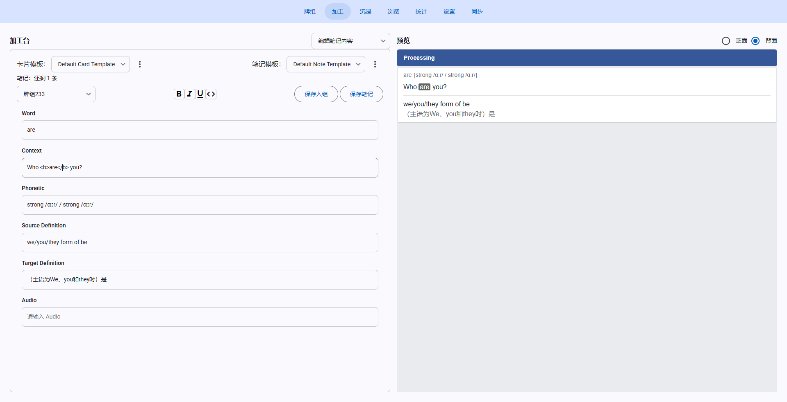
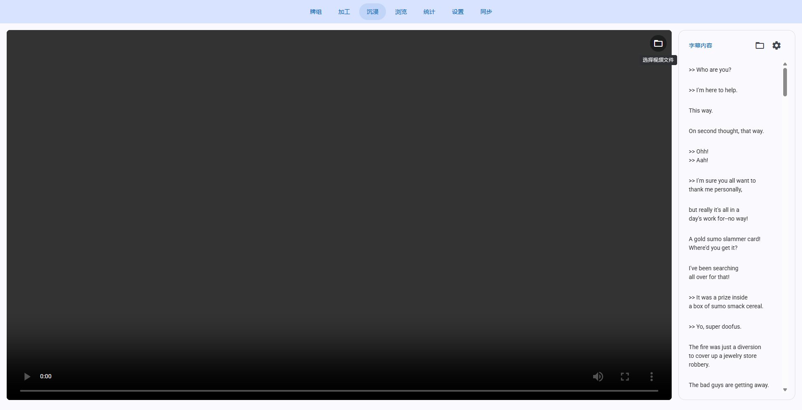
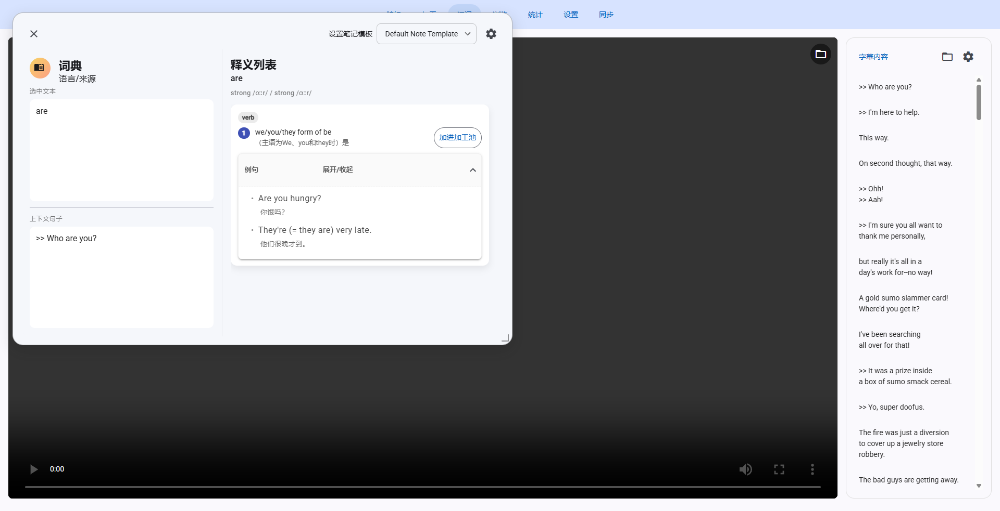

# EnLangMemo（基于间隔重复学习英语软件）

## 介绍

本项目为个人兴趣而开发，~~没有后续维护的保证,随时准备跑路。~~ 后续维护看心情。

基本上，这个项目是落地自己想法实现的，不过也欢迎 fork 和 PR。

目前项目的客户端部分基本上主流程完成了，而剩下的部分就是服务端了，也就是同步服务器的部分。尽管对于本地优先的软件，其实服务端功能并不重要，但因为本人更偏向后端出生加上自己也是就快要实习的学生了，所以接下来打算先开发服务端，后续再完善客户端的功能。

## 技术栈

- 客户端：Electron + Angular + TypeScript + SQLite
- 服务端：PG + Go（开发中）

## 文档

关于文档这部分，没有正式的文档，打算等我完全开发完服务端部分再给出更完整的文档，以及整理一些开发笔记和经验分享。

### 架构图

架构图见[共享的 draw.io 文件](https://drive.google.com/file/d/1pCwharjeiOVuszD5vSBZ1jtfF23gXtaP/view?usp=sharing)，此外这里面也有部分界面的草稿图。

### 本地客户端

数据库的 schema 见 [EnLangMemo DBDiagram](https://dbdiagram.io/d/EnLangMemoDictionary-69aafcb1a3f0aa31e1146507)

这份 schema 有的注释可能不太同步实际开发情况，后续会整理正式版

## 核心界面展示

主界面：

复习界面：

加工界面：

沉浸界面：

词典界面：

## TODO

- [ ] 同步服务器开发
- [ ] SQLite 的 rowid 抉择是否要保留
- [ ] FSRS 牌组算法参数的训练和配置对接
- [ ] 已成型卡片的删除、编辑功能
- [ ] 删除笔记模板
- [ ] 支持媒体文件
- [ ] 加工界面给卡片切换笔记模板，映射现有模板到新模板
- [ ] 复习界面过程编辑笔记内容（临时切到加工界面），并提供可返回按钮。
- [ ] 自研 ASS 字幕解析格式支持
- [ ] 笔记内容编辑界面的富文本编辑器实现（不打算引入库）
- [ ] 沉浸界面的视频各种格式支持以及远程获取流功能
- [ ] 自选时区
- [ ] 备份功能
- [ ] 自定义 Sibling 池，源自 Anki 笔记生成多张卡片为 Sibling 

## 个人开发动机

1. 大一时，在知乎上看到了一篇文章：[Refold 学习外语](https://zhuanlan.zhihu.com/p/671671625) 的语言学习思路，就开始用 Anki 和思源来搭建学习工作流。不过，用了一段时间后发现摘录视频字幕到思源，后续再导入进 Anki 效率太低了，就想要开发一个工具来简化这个过程，但是碍于此时的我不会前端/客户端开发所以告终。
2. 根据第一点，不足以推动我学习前端/客户端开发，所以并没有正式去开发这个工具。不过，随着大二的到来，因为某个老师邀请我参加某个比赛，偶然间想起有个项目想做，就开始筹备了这个项目的开发。不过，我并没有选择拿着这个项目参加比赛，而是当成一个兴趣项目来开发，毕竟我对于项目想法很多，也更希望能自己能落地其他想法。
3. 如第二点所说，这个项目实际上除了 [间隔重复](https://zhuanlan.zhihu.com/p/305651556)，还有一点是对于间隔重复算法的一些奇思妙想，比如能否根据用户相同语言释义下的多个卡片的遗忘或学习情况，统计出用户对当前释义的掌握程度，甚至“学习迁移率”，而不是仅仅用遗忘率作为间隔重复算法的研究方向之一，不过碍于我不是全知全能的人，算法研究部分个人几乎没法进行，目前只能提供软件上的基础，进行数据收集，假设有时间和机会我会尝试的（。不过悲观一点是，即使我有能力进行算法研发，数据收集可能也有限，数据量不足以得出更多结论。